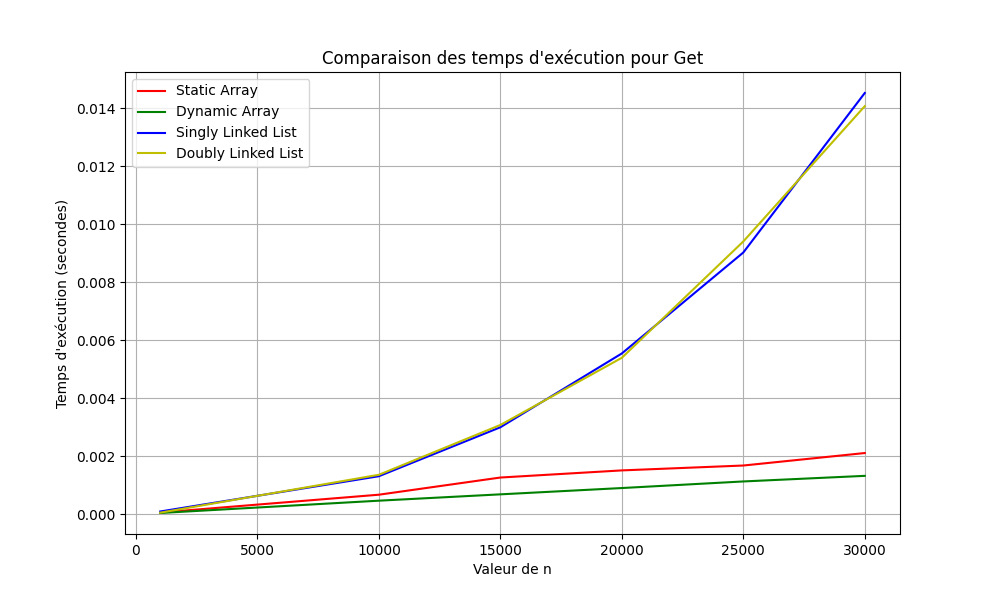

# Rapport final

Voici le rapport final pour le TP1 qui consiste a calculer la vitesse de 4 containers de type:

#### • Tableau statique ####
#### • Tableau dynamique ####
#### • Liste simplement chaînée ####
#### • Liste doublement chaînée ####

## Résultats des tests ##

### Methode get ###

### Methode insert_head ###
### Methode insert_mid ###
### Methode insert_tail ###
### Methode delete_head ###
### Methode delete_mid ###
### Methode delete_tail ###
