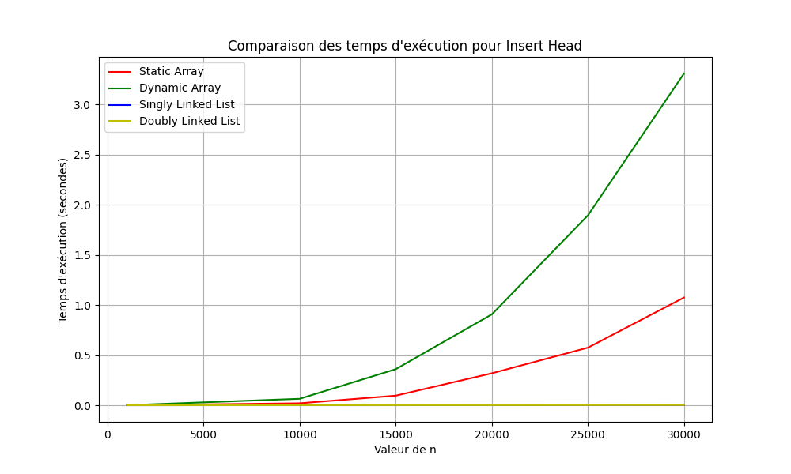
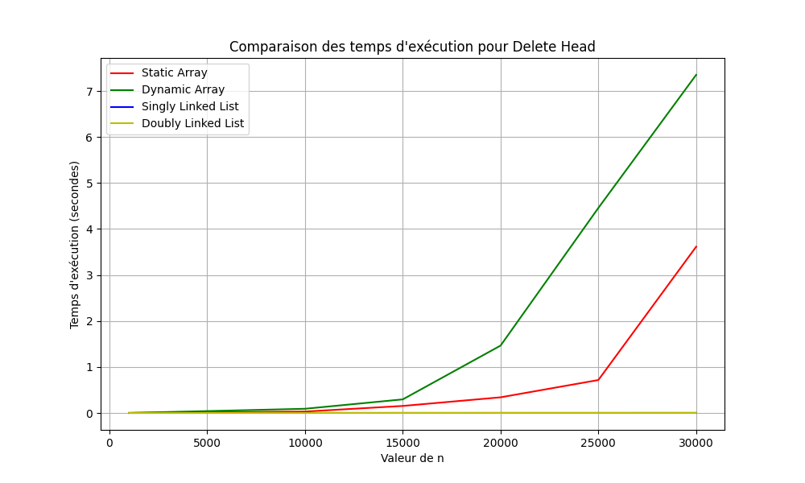
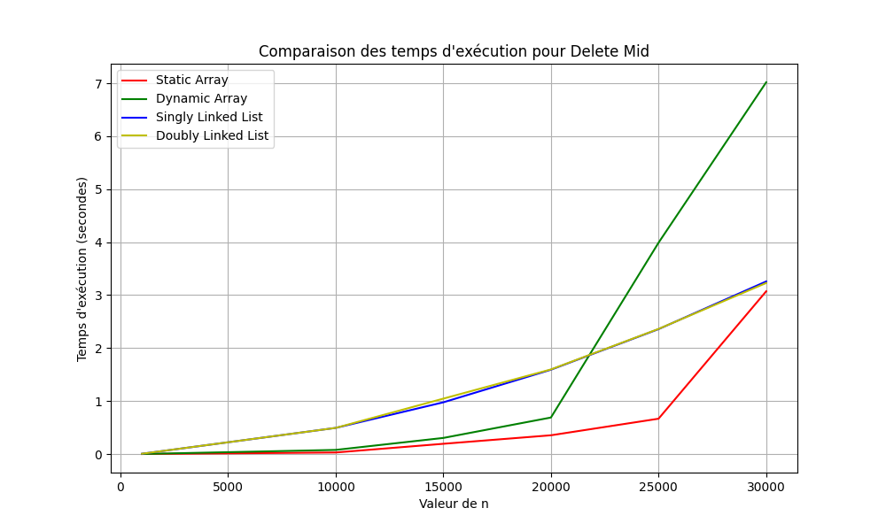

# Rapport final
## Introduction

Voici le rapport final pour le TP1 qui consiste a calculer la vitesse de 4 containers de type:

#### • Tableau statique
#### • Tableau dynamique
#### • Liste simplement chaînée
#### • Liste doublement chaînée

## Résultats des tests

### Methode get

On peut voir que pour la static array et la dynamic array restent tres linéaires tandis que pour la liste simplement chaînée et la liste doublement chaînée on a des courbes qui sont plus exponentielles.

### Methode insert_head

On peut voir que pour les deux containers de linked list on a des courbes qui sont tres linéaires tandis que pour la static array et la dynamic array on a des courbes qui sont plus exponentielles. La dynamic array a la courbe la plus prononcee.

### Methode insert_mid

Cette fois, les 4 containers on une courbes exponentielles. Plus faible en temps pour les deux linked list et la dynamic array est la plus couteuse en temps.

### Methode insert_tail

On peut voir que les 4 courbes sembles etres linéaires et prendre tres peu de temps pour inserer des elements a la fin. Environ 0.0006 secondes pour 30000 elements pour la static array.

### Methode delete_head

Les deux linkendlist sont les plus rapides pour supprimer des elements a la tete avec une droite tres lineaire. La dinamic array est la plus couteuse en temps.

### Methode delete_mid

La dinamic array est plus vite que les deux linked list jusqu'a environ 20000 éléments et devient plus lente que les autres par la suite.

### Methode delete_tail

Les 4 containers sont tres lineaires mais la static array prends plus de temps que les 2 autres.

## Conclusion

On peut voir que la static array est la plus rapide pour les 4 methodes. La dynamic array est la plus lente pour les 4 methodes. Les deux linked list sont les plus rapides pour les 4 methodes.

Cela montre bien que le choix du container est tres important pour la vitesse d'execution d'un programme dépendant de la taille des données à manipuler.

### Lancement des tests

Le projet peut etre lancer avec la commande ctrl + shift + b a partir du task.json du dossier .vscode.
