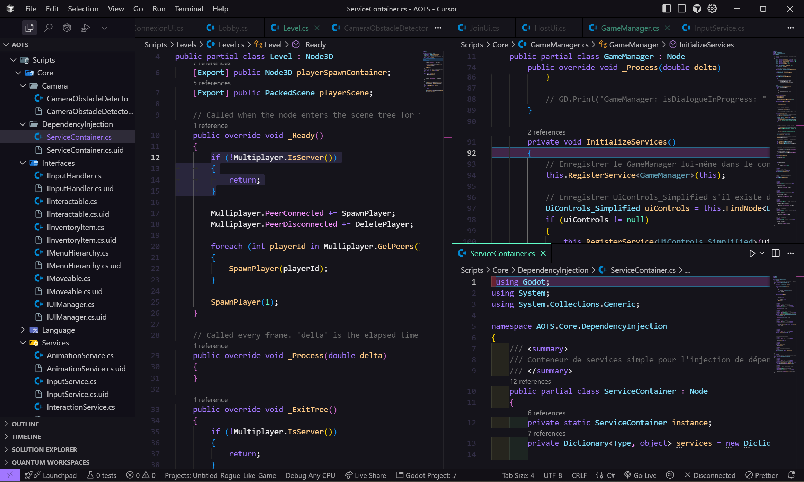
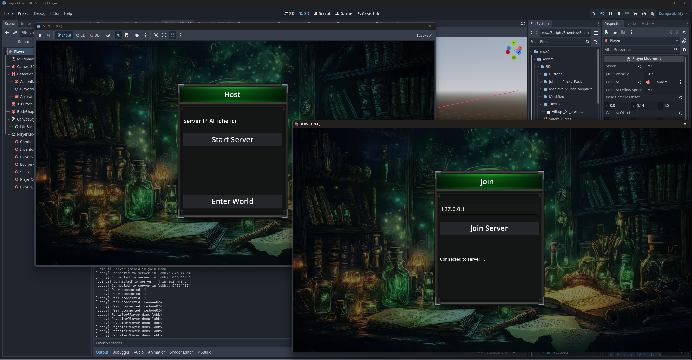
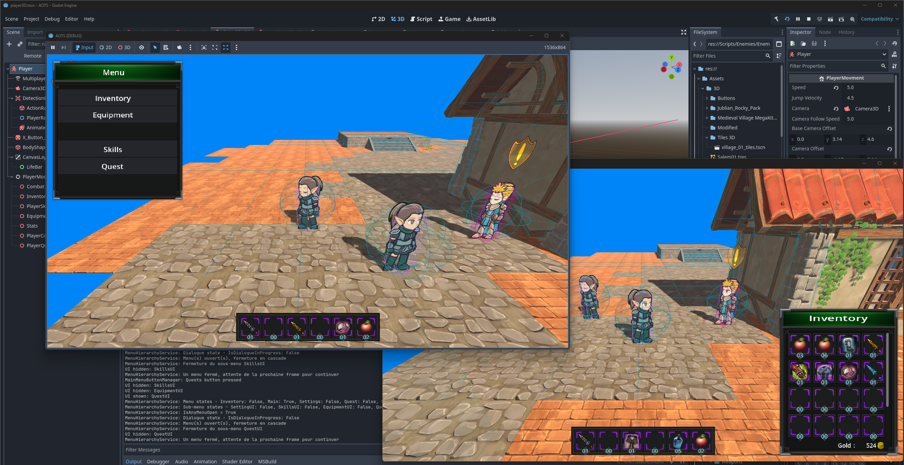

# Guide des Patrons de Conception - TP4

## Équipe
- [Nom du coéquipier 1]
- [Nom du coéquipier 2]

## Description
Ce projet contient un guide d'utilisation des patrons de conception vus dans le cours ALGORITHMES ET MODÈLES DE PROGRAMMATION, organisé en deux parties principales :

1. **Problèmes et solutions** : Guide sous forme "problème → solution → exemple de code basé sur un jeux vidéo que je suis en train de développer dans le Game Engine Godot en C# convertie en python"
2. **Similitudes, différences et risques de confusion** : Analyse comparative entre patrons similaires

## Structure du projet
- `guide.md` : Document principal du guide
- `README.md` : Ce fichier

## Patrons couverts
- Singleton
- Observateur
- Factory
- Abstract Factory
- Adaptateur
- Décorateur
- Façade
- Composite
- Strategy
- State

## Just for fun
Voici des images du jeu que je suis en train de construire en suivant le plus possible les patrons de conception mais en C#.

images du jeu:

### Un peu de code

### Connexion UI

### Demo ingame

